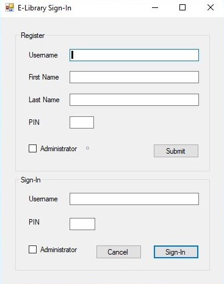
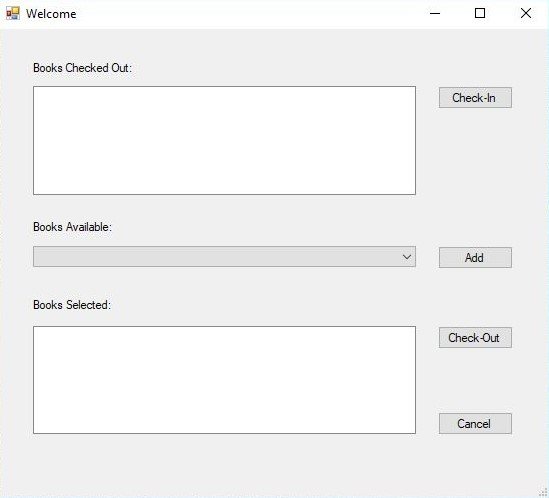
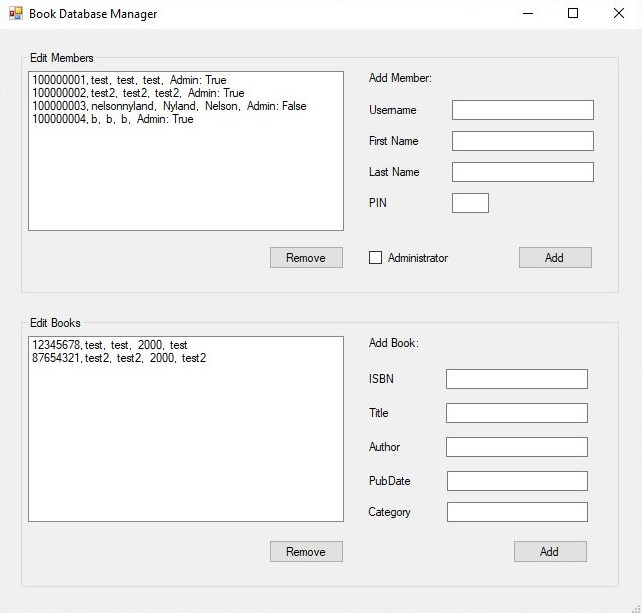

# E-Library Book Manager
## A Library Kiosk Application
*Made using .NET Windows Forms*
### Collaborators: Nelson Nyland, Krista Betcher

------------------------------------------------
#### Registration & Sign-in:
When you open the E-Library Book Manager you are greeted by a registration and sign-in window. 
An alternate Administrator checkbox is available for use in editing member and book information.

---------------------------------------------------
#### Library Services:
Once signed-in, a new window opens up with a listbox for books that have been checked-out. There is also a drop-down box filled with books available and a listbox for books selected to check-out. Buttons for check-in, selection, and check-out are shown.

-----------------------------------------------------
#### Administrator Services:

Administrator services are available for editing member and book information. This functionality is accessed by selecting the administrator checkbox when signing-in.

